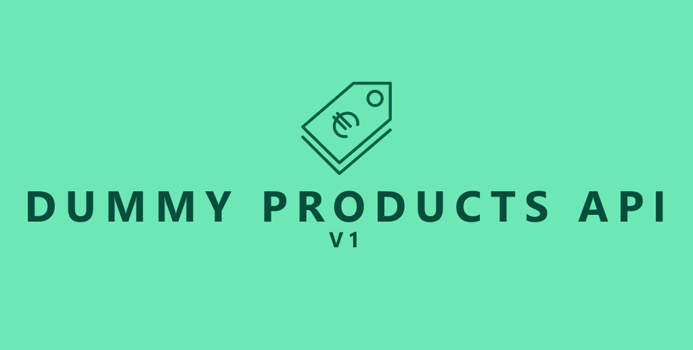
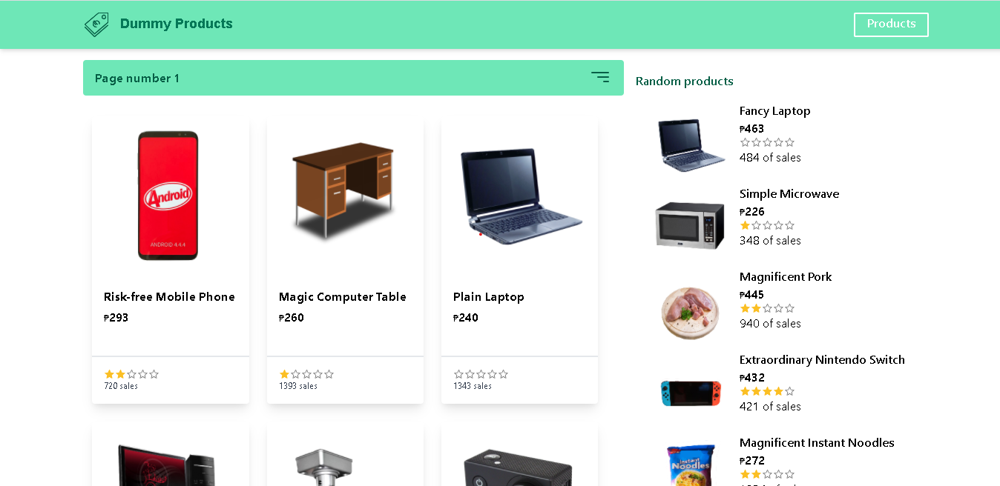
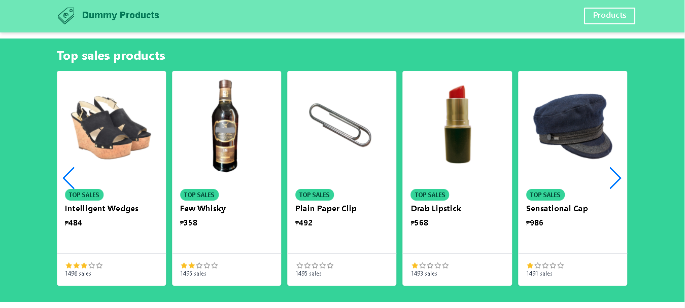
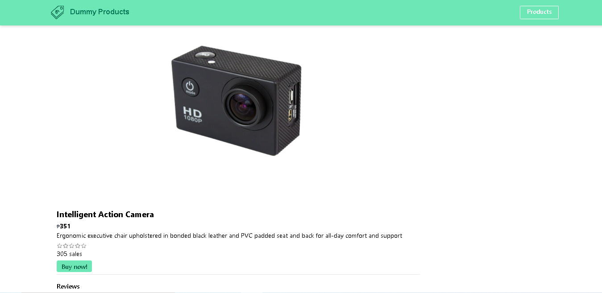
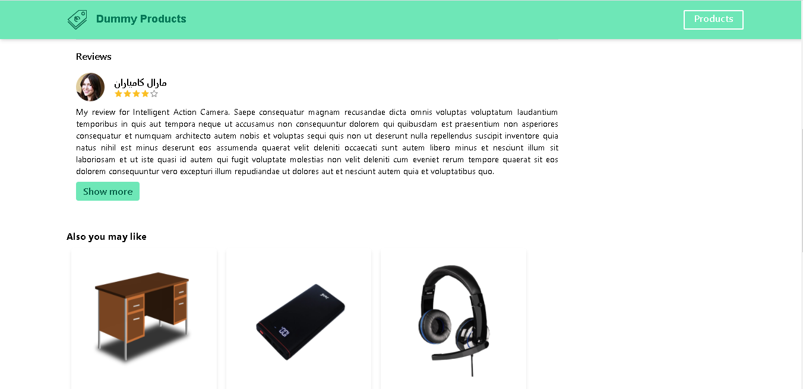

# Dummy products front end v1


Consuming of [Dummy products API](https://dummyproducts-api.herokuapp.com/) using React JS. **Dummy products API** is primarily used for prototyping e-commerce sites and this code base is to display the contents of API



## Features
    * Viewing top sales & top rated products
    * Viewing pagination of products
    * Filtering of products
    * Viewing individual product and their reviews

## Installation
Requirements 
    [NodeJS](https://nodejs.org/en/)
    [Git](https://git-scm.com/downloads)

Running it locally:
Get a API key from [Dummy products API](https://dummyproducts-api.herokuapp.com/) and create a .env file copy the format in .env.example given

```
git clone https://github.com/Dahnnyboi/dummy-products.git
npm install
npm run start
```

## Sample Images





## Things to change in version 2
Look at [development branch](https://github.com/Dahnnyboi/dummy-products/tree/development) to see what improvements it needs